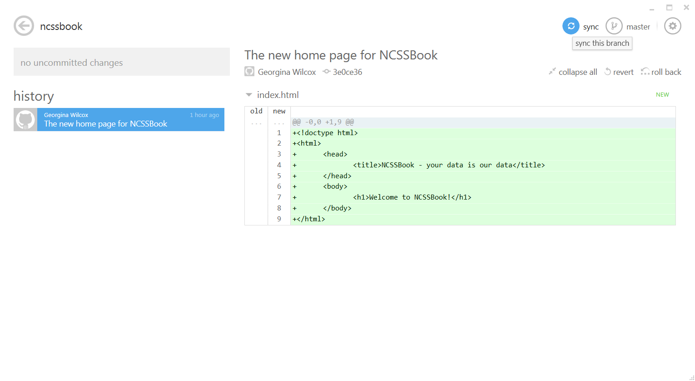

# Version Control
## What exactly is version control?
Version control is simply a way to track your files as they change. 

At its core it's really not that complicated at all.
You may have even created a very simple version of it yourself.
Something like this:

  * ~Essay FINAL really final this time.doc
  * Essay.doc
  * Essay (final draft).doc
  * Essay FINAL.doc
  * Essay FINAL1.doc
  * Essay FINAL countdown.doc
  * Essay (first draft).doc
  * Essay (first draft) 1.doc

## Why use a version control tool?
There are many problems that will appear with a solution like the above one.
What is the file we're currently working on?
How do we find that sentence about the effect of the plutocracy on bourgeois society? Was it in "Essay FINAL.doc" or "Essay.doc"?
What if we just want to change back to the version of the essay we had at the start of the day? What if we've already saved over that version?
What if we need to collaborate with someone on our essay? Do we have to manual go through and find all the changes we both made and merge them together?

We could of course come up with increasingly more consistent and complicated schemes for naming and storing our files.
At some point though we should probably ask ourselves if someone has already made a tool for helping us do this.
The answer is of course yes! There are many different version control systems available.
At NCSS we will be using git <http://git-scm.com/>


# Git
## What is git?
### The components of git
<!-- It would be helpful to have a diagram that summarises this section -->

In the most basic sense git is made up of collections of files called "repositories".
Each repository is a directory that contains the files for a particular project, for example a small social network site.

A repository also contains the history of these files as they've changed.
These changes are known as "commits".

Each commit can have multiple files associated with it and has associated with it a message that describes the commit's contents.
Commits are manually created and can be considered a discrete set of work done.
That is, I wouldn't commit every time I saved my python program because a program with syntax errors probably isn't helpful to keep a record of.
But I would commit if I had written a simple working version of a function that I planned to make more complicated.

Before committing files we first "stage" them.
This staging helps us differentiate changes we want to commit (i.e., record the history of) and those we want to ignore for now.
Staging allows to add/remove files from a commit before confirming the commit and giving the commit a descriptive message.

In git there is a distinction between "tracked" and "untracked" files.
Tracked files have been staged and then committed.
They are associated with the repository and will be copied if the repository is "cloned".
Untracked files are files that are not associated with the repository since they have never been committed or removed from the repository.
Both tracked and untracked files can exist in the same directory as the repository. Only tracked files are a part of the repository.

### Collaborating with git
<!-- This section should also have a diagram -->

Git is a "Distributed Version Control System".
This means that everyone has their own repository with its own files and commits.
The repository you have is called the "local" repository. External repositories are called "remote" repositories.
Collaboration is done by "push"ing and "pull"ing code to and from remote repositories.

Let's say your friend has a repository for a cool space invaders game and you'd like to make some improvements to it.
The first thing we would do is create our own local version of the repository by "cloning" it.

The next step is making our changes to the game, sound effects and James Curran UFOs.
Ideally committing each of these changes separately.
Then we "push" the changes we made to our friend.

Our friend then makes some changes of his own which include some better colours and graphics.
We can get these changes from her remote repository by telling git to "pull" them.
A git "pull" essentially "fetches" the changes from the remote location and "merges" them with our changes.

## A Walkthrough
All of these concepts can be quite tricky to understand.
Especially if you've never used a version control system before.
Perhaps the best way to learn version control is by using it in a real world setting.

The following section walks through how a group of programmers might use version control.
You don't need to understand it all at once and you certainly don't need to remember it all.
Use each section as a reference for how to perform certain tasks with version control.

There will be screenshots of Github for Windows and command line samples.
Feel free to use whichever you are most comfortable with.

### The scenario
Dom, Smerity, Kenni and Georgina are creating a social network site with python!
For the sake of brevity let's call this team "Group 0".
All of them have Github for Windows installed already.
All of them will be adding changes to the project at some stage.

### Getting set up
The first thing Group 0 need to do is create a new repository.

<!--
I don't know if we want to use Github or Bitbucket as opposed to a vanilla git repo
I'm inclined to avoid Github and Bitbucket to avoid having to create/manage accounts for those services.
  - Kenni
-->

Kenni creates a repository called ncssbook.

<!-- Screenshot of GfW repo creation -->


```bash
git init ncssbook
```

This repository won't be worked on directly by any of Group 0.
Instead this repository is like a remote backup that will be updated with the latest version of the code as the group member "push" it out.

<!-- Diagram of the relationship between the repos -->


Now everyone has to "clone" a copy of ncssbook for themselves.
To be able to do this they have to be able to access the repository over the internet.
Luckily Kenni has put the repo on the NCSS servers.

To clone the repository Dom simply drags a link to the repository onto Github for Windows.

<!-- Screenshot of GfW repo cloning -->


```bash
git clone http://ncss.edu.au/2014/group0/ncssbook.git
```


### Adding new files
The first thing Group 0 are going to do with this new repository is create an index page for their social network.
To do this Georgina simply creates a file called `index.html` using her favourite text editor (vimacs).

<!-- Screenshot of folder -->


Once the file exists it can be added to the repository using Github for Windows.
We can see on thee right hand side of the window the list of new files.
For the moment this is just `index.html`.
The checkbox next to its name indicates Georgina wants it to be part of the repository.

<!-- Screenshot of new files in GfW -->


```bash
# Show the files that are new
git status

# Add the index page to the commit
git add index.html
```
Now it's time for Georgina to commit the changes to her repository.
To do this she adds a message to the text field and then clicks 'commit to master'.

<!-- Screenshot of committing in GfW -->


```bash
git commit -m "The new home page for NCSSBook"
```


```bash
git log
```


### Sharing the changes
At the moment Georgina is the only person who has the NCSSBook homepage.
So the next step for Georgina is to push the commit containing `index.html` to the remote repository Kenni created.

<!-- Screenshot of pushing commits in GfW -->


```bash
git push
```

Now everyone else in Group 0 can pull the changes stored on the remote repository.
For example Smerity clicks on the 'sync' button to pull the commit.

<!-- Screenshot of pullng commits in GfW -->


```bash
git pull
```


### Adding more changes
Having updated his repository with Georgina's changes, Smerity wants to make some changes of his own.
He changes the title and adds some explanatory text to `index.html` in his text editor.
In Github for Windows we can see the changes he has made.

<!-- Screenshot of diff in GfW -->


```bash
git diff
```

Smerity can now add a commit message, commit to master, then sync the repository to share his changes.
This is much the same process as Georgina went through when she added a new file earlier.


### Merging conflicting work
While Smerity was making his changes Dom was making some changes of his own to the page.
He has already committed his changes to his local repository and is about to sync his changes with the remote repository.

<!-- Screenshot of up/down commits in GfW -->


```bash
# Get the changes from the remote repository
git fetch

# Check the local repository's status
git status
# On branch master
# Your branch and 'origin/master' have diverged,
# and have 1 and 1 different commit(s) each, respectively.
#
nothing to commit (working directory clean)
```

Dom sees in the top right corner of Github for Windows that his repository has a commit that the remote repository doesn't have yet and vice-versa.
So when he clicks the sync button he knows theres a possibility git cannot merge his changes with the remote changes.

<!-- Screenshot of conflicting commits in GfW -->


```bash
git pull
Auto-merging index.html
CONFLICT (content): Merge conflict in index.html
Automatic merge failed; fix conflicts and then commit the result.
```

It turns out Dom's changes conflict with Smerity's changes.
When Dom clicks on the button to show uncommitted changes he can see where the conflicts are.

<!-- Screenshot of conflict diff in GfW -->


```bash
git diff
```

The lines between `<<<<<<< HEAD` and `=======` are the lines from Dom's local repository.
The lines between `=======` and `>>>>>>> 649c884a14...` are the lines from the remote repository (i.e., Smerity's changes).

Now Dom has to choose which pieces of the conflicting file he would like to keep.
In the end he decides he likes Smerity's heading but thinks his own subtitle is better.
Dom edits the file in his text editor, adds a commit message and then clicks 'commit to master'.

<!-- Screenshot of conflict merge in GfW -->


```bash
# After fixing conflicts in index.html
git add index.html
git commit -m "Changed NCSSBook heading"

# See all of the commits
git log
```

The final step is for Dom to send his changes to the remote repository by clicking the sync button.

<!-- Screenshot of syncing merge in GfW -->


```bash
git status
# On branch master
# Your branch is ahead of 'origin/master' by 2 commits.
#
nothing to commit (working directory clean)

git push
```

### Fixing mistakes

<!--
Unstaging files
  git reset HEAD

Untracking files
  git rm --cached <file>
Completely remove file
  git rm <file>

Undo the last commit 
  git reset --soft HEAD^

Fixing the previous commit
  git add <file> 
  git commit --amend

Why it's a bad idea to try and change the remote repo's history
-->


### Avoiding conflicts

<!--
Why branches?

Create a new branch
  git branch <branch>

Changing branch
  git checkout <branch> 

Merging branches
  git checkout <branch-to-merge-into>
  git merge <branch-to-merge>
--> 


### Going back in time

<!--
Viewing old commits
  git log

Labelling commits
  git tag

Stashing changes temporarily
  git stash
Quick changes
  git pop

Viewing old files
  git diff <commit-a> <commit-b>

Revert to previous commit
  git reset --hard

Revert to old commit
  git revert <commit>
-->

## Workflow
<!-- A digram explaining the stage/commit/pull/push workflow -->
